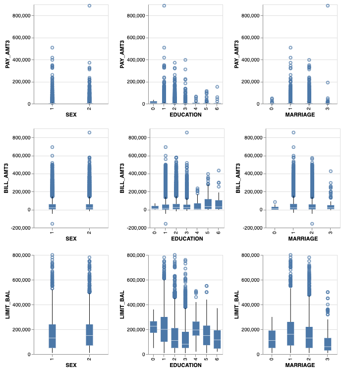

**Project proposal**

*Overview:*

The prediction of Customer default payments is an important issue in risk management by banks and developing accurate predictive tools is highly needed to mitigate losses associated with Credit Risk. In this project, we will be using default of credit card clients in Taiwan to predict the credit card default for new customers. 

*Data Set:*

Data Set is publicly available from UCI Machine Learning Repository Irvine, CA: University of California, School of Information and Computer Science . The data contain 30,000 instances in total and 23 features about customers' payment, bill histories and demographic factors.

*Research question:*

The main scientific question we are asking in this project is a predictive question.  
What features predict default payment?
In the course of answering the question, we will be testing several analytical methods and attempts to develop a highly accurate model for the prediction of credit card default

*How the data will be analyzed:*

As an initial step, the data set will be split into training and testing data set. The training data set will be then used to fit a decision tree at first to learn the weights associated with each feature. Cross-validation will be applied to estimate the accuracy of the model in out-of-sample data. Other model such as Logistic Regression, K-nearest neighborhood and Support Vector Machine will also be explored. The model with the highest performance will be selected based on the balance  between bias and varianc. The parameters that learned from the best model will then be used to infer the main features that predict default payment. Finally we will test our model on the testing data to evaluate the performance of the overall performance of the model on new data.

*Exploratory Data Analysis:*

The Data Overview table shown in the EDA file provides a summary of the data. EDA was performed on the training data set. After splitting the data into training and test set, it contains 22500 observations. The mean of the credit limit is around 167229 and the mean of the age of customers in the data set is 35. 

Exploratory plots were also provided in the EDA.  For example, in the plot shown below we showed that there is an association between credit limit and payment default which is expected as credit limit is usually associated with good credit history. Age, on the other hand, does not seem to be able well suited to explain the response variable, which is in our case "DEFAULT_NEXT_MONTH". So, unlike credit limit , age is not expected to be among the strongest predictors for credit default. The too many outliers in the boxplot indicate heavy-tail distribution for many of the feature’s relationships such as Limit balance and Sex, Education and Marriage which is important to consider during the subsequent data analysis. In summary, the data set is rich and appropriate for the reach question we are trying to answer. The EDA shows that many covariates have strong colinearity. It also reveals that some features are likely to have a stronger association with response than others.

