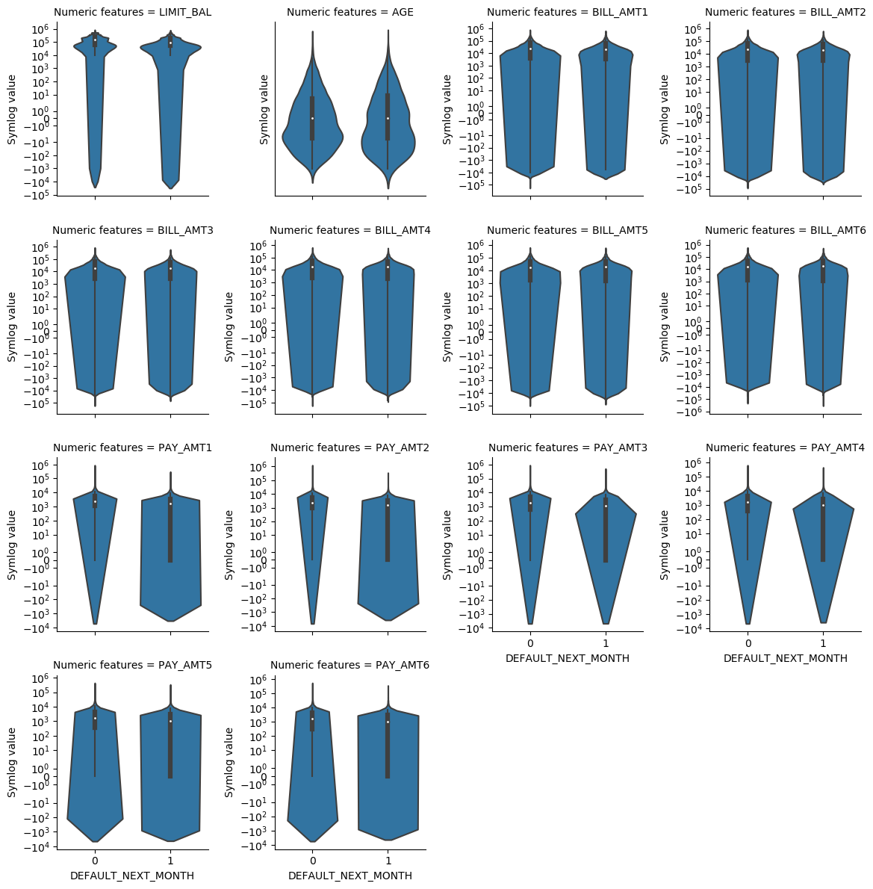

**Project proposal**

*Overview:*

The prediction of Customer default payments is an important issue in risk management by banks and developing accurate predictive tools is highly needed to mitigate losses associated with Credit Risk. In this project, we will be using default of credit card clients in Taiwan to predict the credit card default for new customers. 

*Data Set:*

Data Set is publicly available from [UCI Machine Learning Repository Irvine, CA: University of California, School of Information and Computer Science](https://archive.ics.uci.edu/ml/datasets/default+of+credit+card+clients). The data contain 30,000 instances in total and 23 features about customers' payment, bill histories and demographic factors.  The data, while hosted by UCI, was originally publicized by Chung Hua University of Taiwan and Tamkang University of Taiwan. The data was collected in 2005 from the Taiwanese market.

*Research question:*

The main scientific question we are asking in this project is a predictive question.  
What features predict default payment?
In the course of answering the question, we will be testing several analytical methods and attempts to develop a highly accurate model for the prediction of credit card default.

*How the data will be analyzed:*

As an initial step, the data set will be split into 75% training and 25% testing data set. We will perform exploratory data analysis to the training set to have an overview of distributions of categorical and numeric predictors and count of the default and non-default payment in the response variable to check if data is imbalanced. We will present it as bar plots. Also, we will check correlations between predictors, because collinearity among predictors will result in indefinite assignment of weights to strongly correlated variables and result in incorrect conclusion. Moreover, possible relationships between predictors and the response variable will be checked and presented as boxplots and stacked bar plots. 

Due to imbalanced class in the response variable, we will use [SMOTE](https://imbalanced-learn.readthedocs.io/en/stable/generated/imblearn.over_sampling.SMOTE.html) (Synthetic Minority Oversampling Technique) to create a balanced data set to fit the model. Moreover, because most numeric predictors are heavy tailed, we will use [`RobustScaler`](https://scikit-learn.org/stable/modules/generated/sklearn.preprocessing.RobustScaler.html) to scale predictors for preprocessing. It scales the data based on the quantile range. Next, for fitting models, because the dataset is not too big and the logistic regression model is interpretable, and to help us find predictors that predict default payment based on weights, we will fit the `LogisticRegression` model, and hyper-parameter tuning to test different variations of the model to predict the class. We will use [`RFE`](https://scikit-learn.org/stable/modules/generated/sklearn.feature_selection.RFE.html#sklearn.feature_selection.RFE)(recursive feature elimination) to prune and select features that predict default payment. For comparison, we will fit the same model with different dataset, one fitted with selected features and one with all features as our baseline model, so we know that we don't lose accuracy from less features. Since the data is imbalanced, and different finance companies have different strategies for loan(how risky they are?), we will assess the models usefulness by analyzing the overall accuracy, recall, precision and AUC. The results are presented as confusion matrix and ROC curve plots in the report. The selected features from the best model will then be used to infer the main features that predict default payment.

*Exploratory Data Analysis:*

The Data Overview table shown in the EDA file provides a summary of the data. EDA was performed on the training data set. After splitting the data into training and test set, it contains 22500 observations. The mean of the credit limit is around 167229 and the mean of the age of customers in the data set is 35. 

Exploratory plots were also provided in the EDA. For example, in the plot shown below we showed that there is an association between credit limit and payment default which is expected as credit limit is usually associated with good credit history. Age, on the other hand, does not seem to be able well suited to explain the response variable, which is in our case "DEFAULT_NEXT_MONTH". So, unlike credit limit , age is not expected to be among the strongest predictors for credit default. The many outliers in the boxplot indicate heavy-tail distribution for many of the feature’s relationships such as Limit balance and Sex, Education and Marriage which is important to consider during the subsequent data analysis. In summary, the data set is rich and appropriate for the research question we are trying to answer. The EDA shows that many covariates have strong collinearity. It also reveals that some features are likely to have a stronger association with response than others.

