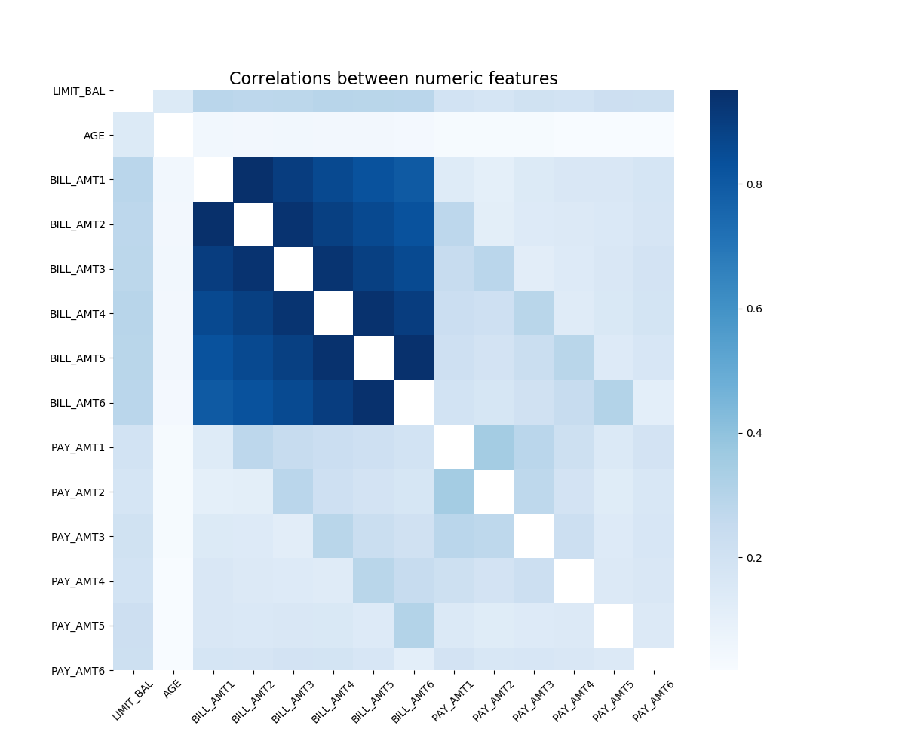

```python
# Importing libraries
import pandas as pd
from sklearn.model_selection import train_test_split
import altair as alt
alt.data_transformers.enable('json')
#alt.renderers.enable('notebook')
import pandas as pd
from sklearn.model_selection import train_test_split
from sklearn.feature_selection import RFE
from sklearn.linear_model import LogisticRegression
import matplotlib.pyplot as plt
from sklearn import preprocessing
import numpy as np
from sklearn.metrics import accuracy_score, plot_confusion_matrix, confusion_matrix, classification_report, roc_auc_score, roc_curve
from sklearn.metrics import recall_score, precision_score
from sklearn.model_selection import GridSearchCV
from imblearn.over_sampling import SMOTE
from docopt import docopt
from sklearn.feature_selection import RFECV
```


```python
# Reading results
evaluation_matrix = pd.read_csv("../results/accuracies.csv")
evaluation_matrix_base = pd.read_csv("../results_baseline//accuracies.csv")
head = pd.read_csv("../results/head.csv")
summary=pd.read_csv("../results/num_describe.csv")
test_accuracy = round(evaluation_matrix.iloc[0,1],2)
test_recall=round(evaluation_matrix.iloc[2,1],2)
precision_accuracy=round(evaluation_matrix.iloc[3,1],2)
auc=round(evaluation_matrix.iloc[4,1],2)
evaluation_matrix;
```

# **Table of Content:**
* [Summary](#first-bullet)
* [Introduction](#second-bullet)
* [Methods](#third-bullet)
* [Results](#fourth-bullet)
* [Conclusions](#fifth-bullet)
* [References](#ref)

# 1. Summary <a class="anchor" id="first-bullet"></a>


In this project we try to find the best features that best predict default customers using machine learning tools. `Logestic Regression` was found to achieve acceptable results on the test data provided to the trained model. The accuracy of the model on test data was about {{test_accuracy}} and the recall on test data found to be {{test_recall}}. The precision for the model on the test was about {{precision_accuracy}} .The area under the ROC Curve for the final model is {{auc}}.

Due to the risk associated with wrongly labeled customers as non-defaul, the model was designed to reduce the false positive (false postive rate). This was also balanced with the overall accuracy on the training data. The model predict the following {{}} features to be the most important features to predict customers default.

1. Amount of the given credit (NT dollar): it includes both the individual consumer credit and his/her family (supplementary) credit.
2. EDUCATION
3. MARRIAGE
4. AGE
5. Past monthly repayment status in September 2005
6. Past monthly repayment status in September 2005
7. Amount of previous payment (NT dollar) in September 2005


# 2. Introduction <a class="anchor" id="second-bullet"></a>
Prediction of customers default behaviour is critically important in Risk Management by lenders. In particular,  there has been a significant interest in identifying features that are associated with the highest prediction power to reduce the overall lender's credit risk. In this study, we perform a data-informed analysis to build a model that can sucssuflly capture features that predict default payment.


# 3. Methods <a class="anchor" id="third-bullet"></a>
## Data
We used credit default data collected from the Taiwanese market in 2005. The Data Set is available from [UCI Machine Learning Repository Irvine, CA: University of California, School of Information and Computer Science](https://archive.ics.uci.edu/ml/datasets/default+of+credit+card+clients). The data that contains 23 features from 30,000 customers. was originally publicized by Chung Hua University of Taiwan and Tamkang University of Taiwan. Features include :

- `LIMIT_BAL`: Amount of the given credit (NT dollar): it includes both the individual consumer credit and his/her family (supplementary) credit. 
- `SEX`: Gender(1 = male; 2 = female).
- `EDUCATION`: Education (1 = graduate school; 2 = university; 3 = high school; 4 = others). 
- `MARRIAGE`: Marital status (1 = married; 2 = single; 3 = others).  
- `AGE`: Age (year).  
- `PAY_1`, `PAY_2`, ..., `PAY_6`: Past monthly repayment status in September 2005, August 2005, ..., April 2005 respectively. ( -1 = pay duly; 1 = payment delay for one month; 2 = payment delay for two months; . . .; 8 = payment delay for eight months; 9 = payment delay for nine months and above.)  
- `BILL_AMT1`, `BILL_AMT2`, ..., `BILL_AMT6`: Amount of bill statement (NT dollar) in September 2005, August 2005, ..., April 2005 respectively.  
- `PAY_AMT1`, `PAY_AMT2`, ..., `PAY_AMT6`: Amount of previous payment (NT dollar) in September 2005, August 2005, ..., April 2005 respectively.  


## Analysis

Immediately after importing the data it was split into traning and test data. Only 75% of the data was used to train the models and the test data was only used to obtain the test performance of the model on unseen data. 


```python
head
```


<div>
<style scoped>
    .dataframe tbody tr th:only-of-type {
        vertical-align: middle;
    }

    .dataframe tbody tr th {
        vertical-align: top;
    }

    .dataframe thead th {
        text-align: right;
    }
</style>
<table border="1" class="dataframe">
  <thead>
    <tr style="text-align: right;">
      <th></th>
      <th>ID</th>
      <th>LIMIT_BAL</th>
      <th>SEX</th>
      <th>EDUCATION</th>
      <th>MARRIAGE</th>
      <th>AGE</th>
      <th>PAY_1</th>
      <th>PAY_2</th>
      <th>PAY_3</th>
      <th>PAY_4</th>
      <th>...</th>
      <th>BILL_AMT4</th>
      <th>BILL_AMT5</th>
      <th>BILL_AMT6</th>
      <th>PAY_AMT1</th>
      <th>PAY_AMT2</th>
      <th>PAY_AMT3</th>
      <th>PAY_AMT4</th>
      <th>PAY_AMT5</th>
      <th>PAY_AMT6</th>
      <th>DEFAULT_NEXT_MONTH</th>
    </tr>
  </thead>
  <tbody>
    <tr>
      <th>0</th>
      <td>27989</td>
      <td>210000</td>
      <td>2</td>
      <td>2</td>
      <td>1</td>
      <td>30</td>
      <td>0</td>
      <td>0</td>
      <td>0</td>
      <td>0</td>
      <td>...</td>
      <td>45810</td>
      <td>42093</td>
      <td>36587</td>
      <td>3000</td>
      <td>3018</td>
      <td>2000</td>
      <td>1500</td>
      <td>1500</td>
      <td>2000</td>
      <td>0</td>
    </tr>
    <tr>
      <th>1</th>
      <td>2701</td>
      <td>10000</td>
      <td>1</td>
      <td>3</td>
      <td>2</td>
      <td>23</td>
      <td>0</td>
      <td>0</td>
      <td>0</td>
      <td>0</td>
      <td>...</td>
      <td>3615</td>
      <td>4402</td>
      <td>5173</td>
      <td>2000</td>
      <td>1500</td>
      <td>400</td>
      <td>1000</td>
      <td>1000</td>
      <td>500</td>
      <td>0</td>
    </tr>
    <tr>
      <th>2</th>
      <td>18399</td>
      <td>210000</td>
      <td>2</td>
      <td>2</td>
      <td>2</td>
      <td>23</td>
      <td>0</td>
      <td>0</td>
      <td>0</td>
      <td>0</td>
      <td>...</td>
      <td>21032</td>
      <td>19497</td>
      <td>3510</td>
      <td>5000</td>
      <td>5000</td>
      <td>5000</td>
      <td>8000</td>
      <td>2000</td>
      <td>4209</td>
      <td>0</td>
    </tr>
    <tr>
      <th>3</th>
      <td>14563</td>
      <td>240000</td>
      <td>2</td>
      <td>2</td>
      <td>1</td>
      <td>39</td>
      <td>4</td>
      <td>3</td>
      <td>2</td>
      <td>2</td>
      <td>...</td>
      <td>48905</td>
      <td>47993</td>
      <td>52015</td>
      <td>0</td>
      <td>0</td>
      <td>4000</td>
      <td>0</td>
      <td>5000</td>
      <td>2000</td>
      <td>1</td>
    </tr>
    <tr>
      <th>4</th>
      <td>11998</td>
      <td>90000</td>
      <td>1</td>
      <td>2</td>
      <td>2</td>
      <td>34</td>
      <td>1</td>
      <td>2</td>
      <td>0</td>
      <td>-1</td>
      <td>...</td>
      <td>20172</td>
      <td>73512</td>
      <td>72588</td>
      <td>0</td>
      <td>2000</td>
      <td>20172</td>
      <td>73512</td>
      <td>3000</td>
      <td>4000</td>
      <td>0</td>
    </tr>
  </tbody>
</table>
<p>5 rows × 25 columns</p>
</div>


Figure 1. Head of the data used in this study. 

Next, we created list for numeric and categorical features, below is the summary of the traning data. It shows that that mean, standard deviation, min, max etc. The bill amount, payment amount and credit limit ranges are roughly similar which are around 800,000. It's interesting that The medians for the bill statement amounts are around 20,000, but the medians for payment amounts are 2,000. Age ranges from 21 to 75 which is reasonable.


```python
summary
```


<div>
<style scoped>
    .dataframe tbody tr th:only-of-type {
        vertical-align: middle;
    }

    .dataframe tbody tr th {
        vertical-align: top;
    }

    .dataframe thead th {
        text-align: right;
    }
</style>
<table border="1" class="dataframe">
  <thead>
    <tr style="text-align: right;">
      <th></th>
      <th>Unnamed: 0</th>
      <th>LIMIT_BAL</th>
      <th>AGE</th>
      <th>BILL_AMT1</th>
      <th>BILL_AMT2</th>
      <th>BILL_AMT3</th>
      <th>BILL_AMT4</th>
      <th>BILL_AMT5</th>
      <th>BILL_AMT6</th>
      <th>PAY_AMT1</th>
      <th>PAY_AMT2</th>
      <th>PAY_AMT3</th>
      <th>PAY_AMT4</th>
      <th>PAY_AMT5</th>
      <th>PAY_AMT6</th>
    </tr>
  </thead>
  <tbody>
    <tr>
      <th>0</th>
      <td>count</td>
      <td>22500.000000</td>
      <td>22500.000000</td>
      <td>22500.00000</td>
      <td>22500.000000</td>
      <td>22500.000000</td>
      <td>22500.000000</td>
      <td>22500.000000</td>
      <td>22500.000000</td>
      <td>22500.000000</td>
      <td>2.250000e+04</td>
      <td>22500.000000</td>
      <td>22500.000000</td>
      <td>22500.000000</td>
      <td>22500.000000</td>
    </tr>
    <tr>
      <th>1</th>
      <td>mean</td>
      <td>167229.763556</td>
      <td>35.487022</td>
      <td>50992.89800</td>
      <td>48905.718978</td>
      <td>46629.685644</td>
      <td>42932.418844</td>
      <td>39905.282444</td>
      <td>38385.688222</td>
      <td>5714.377733</td>
      <td>5.848260e+03</td>
      <td>5132.902667</td>
      <td>4728.448311</td>
      <td>4725.760978</td>
      <td>5282.126533</td>
    </tr>
    <tr>
      <th>2</th>
      <td>std</td>
      <td>129384.485693</td>
      <td>9.182223</td>
      <td>73064.68632</td>
      <td>70748.066294</td>
      <td>68376.985307</td>
      <td>63802.950987</td>
      <td>60135.853082</td>
      <td>58733.428102</td>
      <td>17078.235838</td>
      <td>2.191690e+04</td>
      <td>16892.473653</td>
      <td>15430.720628</td>
      <td>15138.455175</td>
      <td>18506.384982</td>
    </tr>
    <tr>
      <th>3</th>
      <td>min</td>
      <td>10000.000000</td>
      <td>21.000000</td>
      <td>-165580.00000</td>
      <td>-69777.000000</td>
      <td>-157264.000000</td>
      <td>-170000.000000</td>
      <td>-81334.000000</td>
      <td>-339603.000000</td>
      <td>0.000000</td>
      <td>0.000000e+00</td>
      <td>0.000000</td>
      <td>0.000000</td>
      <td>0.000000</td>
      <td>0.000000</td>
    </tr>
    <tr>
      <th>4</th>
      <td>25%</td>
      <td>50000.000000</td>
      <td>28.000000</td>
      <td>3565.75000</td>
      <td>2928.000000</td>
      <td>2577.000000</td>
      <td>2313.000000</td>
      <td>1711.750000</td>
      <td>1190.000000</td>
      <td>990.000000</td>
      <td>8.000000e+02</td>
      <td>390.000000</td>
      <td>285.750000</td>
      <td>238.000000</td>
      <td>119.750000</td>
    </tr>
    <tr>
      <th>5</th>
      <td>50%</td>
      <td>140000.000000</td>
      <td>34.000000</td>
      <td>22169.00000</td>
      <td>20859.000000</td>
      <td>19889.000000</td>
      <td>18855.500000</td>
      <td>17875.000000</td>
      <td>16715.000000</td>
      <td>2100.000000</td>
      <td>2.001000e+03</td>
      <td>1800.000000</td>
      <td>1500.000000</td>
      <td>1500.000000</td>
      <td>1500.000000</td>
    </tr>
    <tr>
      <th>6</th>
      <td>75%</td>
      <td>240000.000000</td>
      <td>41.000000</td>
      <td>66732.75000</td>
      <td>63104.250000</td>
      <td>59532.500000</td>
      <td>53339.500000</td>
      <td>49743.000000</td>
      <td>48863.500000</td>
      <td>5006.000000</td>
      <td>5.000000e+03</td>
      <td>4512.000000</td>
      <td>4000.000000</td>
      <td>4000.000000</td>
      <td>4000.000000</td>
    </tr>
    <tr>
      <th>7</th>
      <td>max</td>
      <td>800000.000000</td>
      <td>75.000000</td>
      <td>746814.00000</td>
      <td>743970.000000</td>
      <td>855086.000000</td>
      <td>616836.000000</td>
      <td>587067.000000</td>
      <td>568638.000000</td>
      <td>873552.000000</td>
      <td>1.227082e+06</td>
      <td>889043.000000</td>
      <td>621000.000000</td>
      <td>426529.000000</td>
      <td>528666.000000</td>
    </tr>
  </tbody>
</table>
</div>


Figure 2. Summary the data used in this study. 

To learn the association between numeric features we explored their inter-correlations which can be seen below. 
We can observe that some features a stronger co-linearity such as BILL-AMT1,BILL-AMT2,.. to BILL-AMT6. 



Figure 3. Inter-correlation between numeric features

We can also study the correlation between the features and the response varibale. We can see that some of the features have stronger correlation with the response varibale than others, for example LIMIT_BALANCE and Age.


[](roc.png)

Figure 4. Correlation between numeric features and response

Figure 4 also shows that many of the features have a heavy tail distribution.  To mitigate this issue we applied [SMOTE](https://imbalanced-learn.readthedocs.io/en/stable/generated/imblearn.over_sampling.SMOTE.html) (Synthetic Minority Oversampling Technique) on the response variable to create a balanced data set to fit the model. Furthermore, we implemented [`RobustScaler`](https://scikit-learn.org/stable/modules/generated/sklearn.preprocessing.RobustScaler.html) to scale predictors

# 4. Results <a class="anchor" id="fourth-bullet"></a>


We selected logistic regression model(`LogisticRegression`) and [`RFE`](https://scikit-learn.org/stable/modules/generated/sklearn.feature_selection.RFE.html#sklearn.feature_selection.RFE)(recursive feature elimination) as our model since it is more robust given that the dataset has many of the features are not normally distributed. One additional advantage of (`LogisticRegression`) that is much interpretable than more complex models

We started the analysis by applying a robust scalar on the training data-set.Following that we build a model with the full set of features as our base-case model. The confusion matrix, evaluation matrix and ROC results were obtained to set the a bench-mark for for comparison purposes. `RFE` was then used to identify the most useful predictors and consequently we dropped those columns that are deemed as less useful. Eventually 7 features were used to train the model.

The hyperparameters `C` was tunned in the range from -4 to 20 using 5-fold cross-validation and the model was then fitted with the best hyperparameter. Let us now look at the result by glancing into the confusion matrix


Figure 5. Confusion matrix of the fitted model with 7 features

We can see that the best model which uses 7 features tends to correctly predict the customer that defaulted out-performing the base-case model which uses all the features. This is critically important in risk management. We can see that `4600` predictions were made that correctly classified a non-default as a non-default. This is about 600 cases better than the base-case model.  There was also `1200` predictions that were made that incorrectly classified a non-default as a default, actually about 700 cases worse than the best-case model.On the other hand the model was able to predict `940` cases of defaulted customers that actually defaulted which is about 160 cases worse than base-case model. The best-case model was also able to produce `720` predictions were made that incorrectly classified a defaulted customers as a defaulted customers.


Figure 6. Confusion matrix of the fitted model with all 23 features

In terms of accuracy the results are shown below, we can see that the accuracy of the model on test data was about {{test_accuracy}} and the recall on test data found to be {{test_recall}}. The precision for the model on the test was about {{precision_accuracy}} .The area under the ROC Curve for the final model is {{auc}}.


```python
evaluation_matrix
```


<div>
<style scoped>
    .dataframe tbody tr th:only-of-type {
        vertical-align: middle;
    }

    .dataframe tbody tr th {
        vertical-align: top;
    }

    .dataframe thead th {
        text-align: right;
    }
</style>
<table border="1" class="dataframe">
  <thead>
    <tr style="text-align: right;">
      <th></th>
      <th>Unnamed: 0</th>
      <th>result</th>
    </tr>
  </thead>
  <tbody>
    <tr>
      <th>0</th>
      <td>test accuracy</td>
      <td>0.740933</td>
    </tr>
    <tr>
      <th>1</th>
      <td>train accuracy</td>
      <td>0.741733</td>
    </tr>
    <tr>
      <th>2</th>
      <td>test recall</td>
      <td>0.567372</td>
    </tr>
    <tr>
      <th>3</th>
      <td>test precision</td>
      <td>0.433518</td>
    </tr>
    <tr>
      <th>4</th>
      <td>auc score</td>
      <td>0.707454</td>
    </tr>
  </tbody>
</table>
</div>


This is also a good improvement over the base model which use all the 23 features as can see below. In particular we can see that the best-case model performs better in terms of test accuracy and test-precision.


```python
evaluation_matrix_base
```


<div>
<style scoped>
    .dataframe tbody tr th:only-of-type {
        vertical-align: middle;
    }

    .dataframe tbody tr th {
        vertical-align: top;
    }

    .dataframe thead th {
        text-align: right;
    }
</style>
<table border="1" class="dataframe">
  <thead>
    <tr style="text-align: right;">
      <th></th>
      <th>Unnamed: 0</th>
      <th>result</th>
    </tr>
  </thead>
  <tbody>
    <tr>
      <th>0</th>
      <td>test accuracy</td>
      <td>0.676267</td>
    </tr>
    <tr>
      <th>1</th>
      <td>train accuracy</td>
      <td>0.677244</td>
    </tr>
    <tr>
      <th>2</th>
      <td>test recall</td>
      <td>0.656798</td>
    </tr>
    <tr>
      <th>3</th>
      <td>test precision</td>
      <td>0.368850</td>
    </tr>
    <tr>
      <th>4</th>
      <td>auc score</td>
      <td>0.721871</td>
    </tr>
  </tbody>
</table>
</div>


ROC was plotted to to measure the model's discriminative ability. We can see that the model perform fairly good. 


Figure 7. ROC curve for the fitted model with 7 features

# 5. Conclusions <a class="anchor" id="fifth-bullet"></a>

We were able to successfully use `LogisticRegression` model to find the most important features that predict customer default. The model acheives an acceptable level of accuracy on the testing data, better tunning of hyper paramters may result a higher accuracy. Overall, we selected the best-case model to extract the most important features as it is more accurate. The precision of the best-case model is  0.43. In comparison, the base-case model only scores  0.36. While the recall of best-case model decreased from 0.656 to  0.567, AUC score only slightly dropped.  Since the best-case model is more accurate, we expect the following 7 features to have the highest predictive power among all the features

1. Amount of the given credit (NT dollar): it includes both the individual consumer credit and his/her family (supplementary) credit.
2. EDUCATION
3. MARRIAGE
4. AGE
5. Past monthly repayment status in September 2005
6. Past monthly repayment status in September 2005
7. Amount of previous payment (NT dollar) in September 2005


## References <a class="anchor" id="ref"></a>

[1] Dheeru Dua and Casey Graff. UCI machine learning repository, 2017. [UCI Machine Learning Repository Irvine, CA: University of California, School of Information and Computer Science](https://archive.ics.uci.edu/ml/datasets/default+of+credit+card+clients)

[2] [Guido Van Rossum and Fred L. Drake. Python 3 Reference Manual. CreateSpace, Scotts Valley, CA, 2009](https://dl.acm.org/doi/book/10.5555/1593511)

[3] Wickham, H. 2017. tidyverse: Easily Install and Load the ‘Tidyverse’. R package version 1.2.1. https://CRAN.R-project.org/package=tidyverse

[4] Wickham H (2011). “testthat: Get Started with Testing.” The R Journal, 3, 5–10. https://journal.r-project.org/archive/2011-1/RJournal_2011-1_Wickham.pdf.

[5] McKinney, W. (2012). Python for data analysis: Data wrangling with Pandas, NumPy, and IPython. " O'Reilly Media, Inc.".

[6] Nielsen, F. Å. (2014). Python programming—Scripting.

[7] Pedregosa, F., Varoquaux, G., Gramfort, A., Michel, V., Thirion, B., Grisel, O., ... & Vanderplas, J. (2011). Scikit-learn: Machine learning in Python. Journal of machine learning research, 12(Oct), 2825-2830.

[8] VanderPlas, J., Granger, B., Heer, J., Moritz, D., Wongsuphasawat, K., Satyanarayan, A., ... & Sievert, S. (2018). Altair: Interactive statistical visualizations for python. Journal of open source software, 3(32), 1057.

[9] Percival, H. (2014). Test-driven development with Python: obey the testing goat: using Django, Selenium, and JavaScript. " O'Reilly Media, Inc.".

[10] Lemaître, G., Nogueira, F., & Aridas, C. K. (2017). Imbalanced-learn: A python toolbox to tackle the curse of imbalanced datasets in machine learning. The Journal of Machine Learning Research, 18(1), 559-563.


<cite data-cite="Python"></cite>
<cite data-cite="Dua:2019"></cite>


